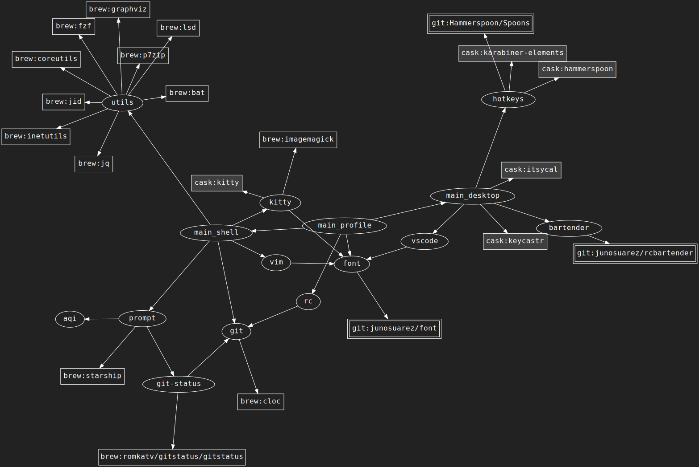

# .dotfiles

these are (for the most part) my daily driver dotfiles
they're not really organized for public consumption,
but do what you like

## installation

```sh
cd ~
git clone git@github.com:junosuarez/rc.git .rc
./init.sh
```

## modules
[ 🔍 click for big](https://raw.githubusercontent.com/junosuarez/rc/main/doc/graph.svg)


## show dotfiles on macos:

`CMD + SHIFT + .`

## modules
this is a way of organizing related things for a specific tool
the directory structure looks something like this:

```
 /modules
   /module
     /info        # module manifest, uses DSL (see below)
     /init.sh     # idempotent, setup basic config that modifies the system
     /bin         # optional, contents get linked to ~/bin
     /alias.sh    # optional, shell aliases
     /profile.sh  # optional, shell profile
```

### `info` manifest
this is evaluated as a shell file, use these special functions to specify dependencies:

- `USE: <module>` depend on another module within this repo
- `BREW: <package>` depend on a package from homebrew


see `./graph.zsh` to explore the module dependency graph

Q: is this whole system a litte elaborate for a personal dotfiles repo?
A: yes.
